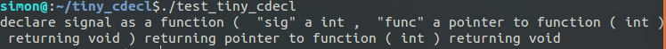

#README

This is a tiny parser for basic C declaration using "Spiral Rule"

###EXAMPLE
I took the famous confusing funcion [signal](http://linux.die.net/man/2/signal) as an example

it's prototype is 

    void (*signal(int sig, void (*func)(int)))(int)
    
and tiny cdecl's output is

more details shown in example.c
